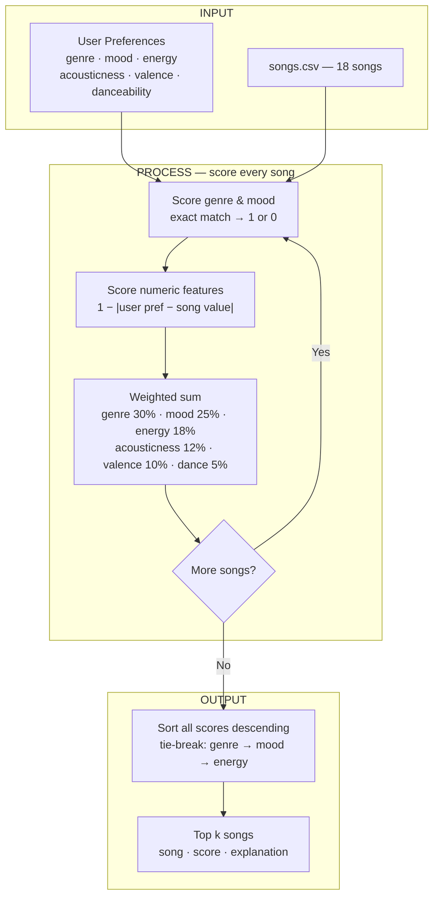

# 🎵 Music Recommender Simulation

## Project Summary

In this project you will build and explain a small music recommender system.

Your goal is to:

- Represent songs and a user "taste profile" as data
- Design a scoring rule that turns that data into recommendations
- Evaluate what your system gets right and wrong
- Reflect on how this mirrors real world AI recommenders

Replace this paragraph with your own summary of what your version does.

---

## How The System Works

Each song is described by six features: genre and mood (categorical) and energy, acousticness, valence, and danceability (numeric, each on a 0–1 scale). A user profile stores one preferred value for each of those same features. To score a song, the recommender compares the song's numeric features to the user's preferences using 1 - |user_preference - song_value|, so closer matches score higher. Genre and mood use an exact-match rule that returns 1 if they match and 0 if they don't. The six feature scores are combined into a single weighted average, with genre (0.30) and mood (0.25) weighted most heavily since a mismatch there overrides any numeric similarity. Once every song in the catalog has a score, the list is sorted descending and the top results are returned. Scoring and ranking are kept as separate steps: scoring measures how well one song fits the user in isolation, while ranking determines the final order across the full catalog and handles tie-breaking.



For each song in the catalog, the system computes a weighted score between 0.0 and 1.0. Genre and mood use an exact-match rule — each returns 1 if it matches the user's preference and 0 if it doesn't. The four numeric features (energy, acousticness, valence, danceability) each use 1 - |user_preference - song_value|, so a closer match scores higher. Those six feature scores are combined as a weighted average: genre (0.30), mood (0.25), energy (0.18), acousticness (0.12), valence (0.10), danceability (0.05). Genre and mood together carry 55% of the total weight, meaning a song that mismatches both can score at most 0.45 regardless of its numeric fit. Once every song is scored, the list is sorted descending; ties are broken by genre match first, then mood match, then energy score. The top k songs are returned. Using the indie pop / happy profile as an example, Rooftop Lights scores 0.99, Sunrise City scores 0.66 (mood matches but genre doesn't), and Storm Runner scores 0.35 (both categorical features miss). Potential biases to be aware of: the high weight on genre and mood means niche or cross-genre songs are systematically penalized even when their acoustic texture is a near-perfect match; acousticness is down-weighted partly because it correlates with energy, but this can cause the system to overlook songs that are high-energy and acoustic (e.g. folk-rock); and the profile's fixed target values assume a single consistent taste, so a user who likes both quiet jazz and intense EDM depending on context will get mediocre recommendations across the board.

---

## Getting Started

### Setup

1. Create a virtual environment (optional but recommended):

   ```bash
   python -m venv .venv
   source .venv/bin/activate      # Mac or Linux
   .venv\Scripts\activate         # Windows

2. Install dependencies

```bash
pip install -r requirements.txt
```

3. Run the app:

```bash
python -m src.main
```

### Running Tests

Run the starter tests with:

```bash
pytest
```

You can add more tests in `tests/test_recommender.py`.

---

## Experiments You Tried

Use this section to document the experiments you ran. For example:

- What happened when you changed the weight on genre from 2.0 to 0.5
- What happened when you added tempo or valence to the score
- How did your system behave for different types of users

---

## Limitations and Risks

Summarize some limitations of your recommender.

Examples:

- It only works on a tiny catalog
- It does not understand lyrics or language
- It might over favor one genre or mood

You will go deeper on this in your model card.

---

## Reflection

Read and complete `model_card.md`:

[**Model Card**](model_card.md)

Write 1 to 2 paragraphs here about what you learned:

- about how recommenders turn data into predictions
- about where bias or unfairness could show up in systems like this


---

## 7. `model_card_template.md`

Combines reflection and model card framing from the Module 3 guidance. :contentReference[oaicite:2]{index=2}  

```markdown
# 🎧 Model Card - Music Recommender Simulation

## 1. Model Name

Give your recommender a name, for example:

> VibeFinder 1.0

---

## 2. Intended Use

- What is this system trying to do
- Who is it for

Example:

> This model suggests 3 to 5 songs from a small catalog based on a user's preferred genre, mood, and energy level. It is for classroom exploration only, not for real users.

---

## 3. How It Works (Short Explanation)

Describe your scoring logic in plain language.

- What features of each song does it consider
- What information about the user does it use
- How does it turn those into a number

Try to avoid code in this section, treat it like an explanation to a non programmer.

---

## 4. Data

Describe your dataset.

- How many songs are in `data/songs.csv`
- Did you add or remove any songs
- What kinds of genres or moods are represented
- Whose taste does this data mostly reflect

---

## 5. Strengths

Where does your recommender work well

You can think about:
- Situations where the top results "felt right"
- Particular user profiles it served well
- Simplicity or transparency benefits

---

## 6. Limitations and Bias

Where does your recommender struggle

Some prompts:
- Does it ignore some genres or moods
- Does it treat all users as if they have the same taste shape
- Is it biased toward high energy or one genre by default
- How could this be unfair if used in a real product

---

## 7. Evaluation

How did you check your system

Examples:
- You tried multiple user profiles and wrote down whether the results matched your expectations
- You compared your simulation to what a real app like Spotify or YouTube tends to recommend
- You wrote tests for your scoring logic

You do not need a numeric metric, but if you used one, explain what it measures.

---

## 8. Future Work

If you had more time, how would you improve this recommender

Examples:

- Add support for multiple users and "group vibe" recommendations
- Balance diversity of songs instead of always picking the closest match
- Use more features, like tempo ranges or lyric themes

---

## 9. Personal Reflection

A few sentences about what you learned:

- What surprised you about how your system behaved
- How did building this change how you think about real music recommenders
- Where do you think human judgment still matters, even if the model seems "smart"

