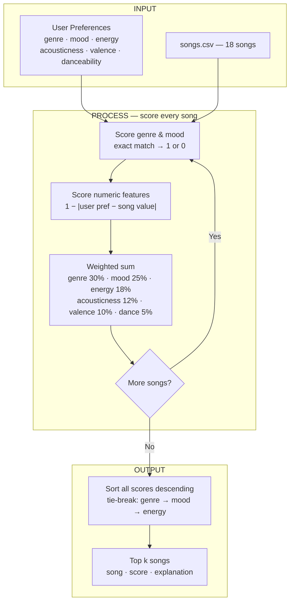

# 🎵 Music Recommender Simulation

## Project Summary

In this project you will build and explain a small music recommender system.

Your goal is to:

- Represent songs and a user "taste profile" as data
- Design a scoring rule that turns that data into recommendations
- Evaluate what your system gets right and wrong
- Reflect on how this mirrors real world AI recommenders

This version scores every song in an 18-song catalog against a user profile and returns the top five matches. Each profile specifies a preferred genre, mood, energy level, acousticness, valence, and danceability. Songs are ranked by a weighted score that rewards genre and mood matches most heavily, then rewards numeric closeness on the remaining four features. The output includes the score and a per-feature breakdown so you can see exactly why each song ranked where it did.

---

## How The System Works

Each song is described by six features: genre and mood (categorical) and energy, acousticness, valence, and danceability (numeric, each on a 0–1 scale). A user profile stores one preferred value for each of those same features. To score a song, the recommender compares the song's numeric features to the user's preferences using 1 - |user_preference - song_value|, so closer matches score higher. Genre and mood use an exact-match rule that returns 1 if they match and 0 if they don't. The six feature scores are combined into a single weighted average, with genre (0.30) and mood (0.25) weighted most heavily since a mismatch there overrides any numeric similarity. Once every song in the catalog has a score, the list is sorted descending and the top results are returned. Scoring and ranking are kept as separate steps: scoring measures how well one song fits the user in isolation, while ranking determines the final order across the full catalog and handles tie-breaking.



For each song in the catalog, the system computes a weighted score between 0.0 and 1.0. Genre and mood use an exact-match rule — each returns 1 if it matches the user's preference and 0 if it doesn't. The four numeric features (energy, acousticness, valence, danceability) each use 1 - |user_preference - song_value|, so a closer match scores higher. Those six feature scores are combined as a weighted average: genre (0.30), mood (0.25), energy (0.18), acousticness (0.12), valence (0.10), danceability (0.05). Genre and mood together carry 55% of the total weight, meaning a song that mismatches both can score at most 0.45 regardless of its numeric fit. Once every song is scored, the list is sorted descending; ties are broken by genre match first, then mood match, then energy score. The top k songs are returned. Using the indie pop / happy profile as an example, Rooftop Lights scores 0.99, Sunrise City scores 0.66 (mood matches but genre doesn't), and Storm Runner scores 0.35 (both categorical features miss). Potential biases to be aware of: the high weight on genre and mood means niche or cross-genre songs are systematically penalized even when their acoustic texture is a near-perfect match; acousticness is down-weighted partly because it correlates with energy, but this can cause the system to overlook songs that are high-energy and acoustic (e.g. folk-rock); and the profile's fixed target values assume a single consistent taste, so a user who likes both quiet jazz and intense EDM depending on context will get mediocre recommendations across the board.

            TOP RECOMMENDATIONS             
--------------------------------------------
 #1  Rooftop Lights               Score: 0.99
--------------------------------------------
      genre match: indie pop (+0.30)
      mood match: happy (+0.25)
      energy: 0.76 vs 0.72 pref (+0.17)
      acousticness: 0.35 vs 0.35 pref (+0.12)
      valence: 0.81 vs 0.8 pref (+0.10)
      danceability: 0.82 vs 0.78 pref (+0.05)

 #2  Sunrise City                 Score: 0.66
--------------------------------------------
      genre mismatch: pop vs indie pop (+0.00)
      mood match: happy (+0.25)
      energy: 0.82 vs 0.72 pref (+0.16)
      acousticness: 0.18 vs 0.35 pref (+0.10)
      valence: 0.84 vs 0.8 pref (+0.10)
      danceability: 0.79 vs 0.78 pref (+0.05)

 #3  Slow Burn                    Score: 0.40
--------------------------------------------
      genre mismatch: r&b vs indie pop (+0.00)
      mood mismatch: romantic vs happy (+0.00)
      energy: 0.55 vs 0.72 pref (+0.15)
      acousticness: 0.4 vs 0.35 pref (+0.11)
      valence: 0.72 vs 0.8 pref (+0.09)
      danceability: 0.76 vs 0.78 pref (+0.05)

 #4  Rise Up Easy                 Score: 0.40
--------------------------------------------
      genre mismatch: reggae vs indie pop (+0.00)
      mood mismatch: uplifting vs happy (+0.00)
      energy: 0.61 vs 0.72 pref (+0.16)
      acousticness: 0.55 vs 0.35 pref (+0.10)
      valence: 0.83 vs 0.8 pref (+0.10)
      danceability: 0.78 vs 0.78 pref (+0.05)

 #5  Night Drive Loop             Score: 0.40
--------------------------------------------
      genre mismatch: synthwave vs indie pop (+0.00)
      mood mismatch: moody vs happy (+0.00)
      energy: 0.75 vs 0.72 pref (+0.17)
      acousticness: 0.22 vs 0.35 pref (+0.10)
      valence: 0.49 vs 0.8 pref (+0.07)
      danceability: 0.73 vs 0.78 pref (+0.05)
---

## Getting Started

### Setup

1. Create a virtual environment (optional but recommended):

   ```bash
   python -m venv .venv
   source .venv/bin/activate      # Mac or Linux
   .venv\Scripts\activate         # Windows

2. Install dependencies

```bash
pip install -r requirements.txt
```

3. Run the app:

```bash
python -m src.main
```

### Running Tests

Run the starter tests with:

```bash
pytest
```

You can add more tests in `tests/test_recommender.py`.

---

## Experiments You Tried

Nine profiles were run against the full catalog, ranging from well-matched listeners (indie pop, rock, lofi) to adversarial cases designed to expose edge behavior. Profiles with a matching genre and mood consistently scored above 0.95, while profiles whose genre or mood didn't exist in the catalog topped out near 0.45 — confirming that the categorical weights dominate the score. The contradictory profile (lofi genre, high-energy numbers) always surfaced lofi songs despite their numeric mismatch, showing the genre weight can override acoustic similarity. The all-zeros and all-ones profiles both produced valid ranked results with no crashes, and the minimal profile (no numeric keys) scored correctly without errors.

Test Cases:
            TOP RECOMMENDATIONS             
  Profile: A — indie listener
--------------------------------------------
 #1  Rooftop Lights               Score: 0.99
--------------------------------------------
      genre match: indie pop (+0.30)
      mood match: happy (+0.25)
      energy: 0.76 vs 0.72 pref (+0.17)
      acousticness: 0.35 vs 0.35 pref (+0.12)
      valence: 0.81 vs 0.8 pref (+0.10)
      danceability: 0.82 vs 0.78 pref (+0.05)

 #2  Sunrise City                 Score: 0.66
--------------------------------------------
      genre mismatch: pop vs indie pop (+0.00)
      mood match: happy (+0.25)
      energy: 0.82 vs 0.72 pref (+0.16)
      acousticness: 0.18 vs 0.35 pref (+0.10)
      valence: 0.84 vs 0.8 pref (+0.10)
      danceability: 0.79 vs 0.78 pref (+0.05)

 #3  Slow Burn                    Score: 0.40
--------------------------------------------
      genre mismatch: r&b vs indie pop (+0.00)
      mood mismatch: romantic vs happy (+0.00)
      energy: 0.55 vs 0.72 pref (+0.15)
      acousticness: 0.4 vs 0.35 pref (+0.11)
      valence: 0.72 vs 0.8 pref (+0.09)
      danceability: 0.76 vs 0.78 pref (+0.05)

 #4  Rise Up Easy                 Score: 0.40
--------------------------------------------
      genre mismatch: reggae vs indie pop (+0.00)
      mood mismatch: uplifting vs happy (+0.00)
      energy: 0.61 vs 0.72 pref (+0.16)
      acousticness: 0.55 vs 0.35 pref (+0.10)
      valence: 0.83 vs 0.8 pref (+0.10)
      danceability: 0.78 vs 0.78 pref (+0.05)

 #5  Night Drive Loop             Score: 0.40
--------------------------------------------
      genre mismatch: synthwave vs indie pop (+0.00)
      mood mismatch: moody vs happy (+0.00)
      energy: 0.75 vs 0.72 pref (+0.17)
      acousticness: 0.22 vs 0.35 pref (+0.10)
      valence: 0.49 vs 0.8 pref (+0.07)
      danceability: 0.73 vs 0.78 pref (+0.05)

            TOP RECOMMENDATIONS             
  Profile: B — intense listener
--------------------------------------------
 #1  Storm Runner                 Score: 0.99
--------------------------------------------
      genre match: rock (+0.30)
      mood match: intense (+0.25)
      energy: 0.91 vs 0.9 pref (+0.18)
      acousticness: 0.1 vs 0.08 pref (+0.12)
      valence: 0.48 vs 0.45 pref (+0.10)
      danceability: 0.66 vs 0.65 pref (+0.05)

 #2  Gym Hero                     Score: 0.65
--------------------------------------------
      genre mismatch: pop vs rock (+0.00)
      mood match: intense (+0.25)
      energy: 0.93 vs 0.9 pref (+0.17)
      acousticness: 0.05 vs 0.08 pref (+0.12)
      valence: 0.77 vs 0.45 pref (+0.07)
      danceability: 0.88 vs 0.65 pref (+0.04)

 #3  Night Drive Loop             Score: 0.40
--------------------------------------------
      genre mismatch: synthwave vs rock (+0.00)
      mood mismatch: moody vs intense (+0.00)
      energy: 0.75 vs 0.9 pref (+0.15)
      acousticness: 0.22 vs 0.08 pref (+0.10)
      valence: 0.49 vs 0.45 pref (+0.10)
      danceability: 0.73 vs 0.65 pref (+0.05)

 #4  Void Crusher                 Score: 0.40
--------------------------------------------
      genre mismatch: metal vs rock (+0.00)
      mood mismatch: dark vs intense (+0.00)
      energy: 0.97 vs 0.9 pref (+0.17)
      acousticness: 0.03 vs 0.08 pref (+0.11)
      valence: 0.2 vs 0.45 pref (+0.08)
      danceability: 0.45 vs 0.65 pref (+0.04)

 #5  Sunrise City                 Score: 0.38
--------------------------------------------
      genre mismatch: pop vs rock (+0.00)
      mood mismatch: happy vs intense (+0.00)
      energy: 0.82 vs 0.9 pref (+0.17)
      acousticness: 0.18 vs 0.08 pref (+0.11)
      valence: 0.84 vs 0.45 pref (+0.06)
      danceability: 0.79 vs 0.65 pref (+0.04)

            TOP RECOMMENDATIONS             
  Profile: C — study listener
--------------------------------------------
 #1  Library Rain                 Score: 0.99
--------------------------------------------
      genre match: lofi (+0.30)
      mood match: chill (+0.25)
      energy: 0.35 vs 0.38 pref (+0.17)
      acousticness: 0.86 vs 0.82 pref (+0.12)
      valence: 0.6 vs 0.6 pref (+0.10)
      danceability: 0.58 vs 0.58 pref (+0.05)

 #2  Midnight Coding              Score: 0.97
--------------------------------------------
      genre match: lofi (+0.30)
      mood match: chill (+0.25)
      energy: 0.42 vs 0.38 pref (+0.17)
      acousticness: 0.71 vs 0.82 pref (+0.11)
      valence: 0.56 vs 0.6 pref (+0.10)
      danceability: 0.62 vs 0.58 pref (+0.05)

 #3  Focus Flow                   Score: 0.74
--------------------------------------------
      genre match: lofi (+0.30)
      mood mismatch: focused vs chill (+0.00)
      energy: 0.4 vs 0.38 pref (+0.18)
      acousticness: 0.78 vs 0.82 pref (+0.12)
      valence: 0.59 vs 0.6 pref (+0.10)
      danceability: 0.6 vs 0.58 pref (+0.05)

 #4  Spacewalk Thoughts           Score: 0.66
--------------------------------------------
      genre mismatch: ambient vs lofi (+0.00)
      mood match: chill (+0.25)
      energy: 0.28 vs 0.38 pref (+0.16)
      acousticness: 0.92 vs 0.82 pref (+0.11)
      valence: 0.65 vs 0.6 pref (+0.10)
      danceability: 0.41 vs 0.58 pref (+0.04)

 #5  Coffee Shop Stories          Score: 0.43
--------------------------------------------
      genre mismatch: jazz vs lofi (+0.00)
      mood mismatch: relaxed vs chill (+0.00)
      energy: 0.37 vs 0.38 pref (+0.18)
      acousticness: 0.89 vs 0.82 pref (+0.11)
      valence: 0.71 vs 0.6 pref (+0.09)
      danceability: 0.54 vs 0.58 pref (+0.05)

            TOP RECOMMENDATIONS             
  Profile: D — max everything
--------------------------------------------
 #1  Gym Hero                     Score: 0.84
--------------------------------------------
      genre match: pop (+0.30)
      mood match: intense (+0.25)
      energy: 0.93 vs 1.0 pref (+0.17)
      acousticness: 0.05 vs 1.0 pref (+0.01)
      valence: 0.77 vs 1.0 pref (+0.08)
      danceability: 0.88 vs 1.0 pref (+0.04)

 #2  Sunrise City                 Score: 0.59
--------------------------------------------
      genre match: pop (+0.30)
      mood mismatch: happy vs intense (+0.00)
      energy: 0.82 vs 1.0 pref (+0.15)
      acousticness: 0.18 vs 1.0 pref (+0.02)
      valence: 0.84 vs 1.0 pref (+0.08)
      danceability: 0.79 vs 1.0 pref (+0.04)

 #3  Storm Runner                 Score: 0.51
--------------------------------------------
      genre mismatch: rock vs pop (+0.00)
      mood match: intense (+0.25)
      energy: 0.91 vs 1.0 pref (+0.16)
      acousticness: 0.1 vs 1.0 pref (+0.01)
      valence: 0.48 vs 1.0 pref (+0.05)
      danceability: 0.66 vs 1.0 pref (+0.03)

 #4  Neon Pulse                   Score: 0.31
--------------------------------------------
      genre mismatch: edm vs pop (+0.00)
      mood mismatch: euphoric vs intense (+0.00)
      energy: 0.95 vs 1.0 pref (+0.17)
      acousticness: 0.02 vs 1.0 pref (+0.00)
      valence: 0.89 vs 1.0 pref (+0.09)
      danceability: 0.94 vs 1.0 pref (+0.05)

 #5  Rooftop Lights               Score: 0.30
--------------------------------------------
      genre mismatch: indie pop vs pop (+0.00)
      mood mismatch: happy vs intense (+0.00)
      energy: 0.76 vs 1.0 pref (+0.14)
      acousticness: 0.35 vs 1.0 pref (+0.04)
      valence: 0.81 vs 1.0 pref (+0.08)
      danceability: 0.82 vs 1.0 pref (+0.04)

           TOP RECOMMENDATIONS             
  Profile: E — silent listener
--------------------------------------------
 #1  Spacewalk Thoughts           Score: 0.75
--------------------------------------------
      genre match: ambient (+0.30)
      mood match: chill (+0.25)
      energy: 0.28 vs 0.0 pref (+0.13)
      acousticness: 0.92 vs 0.0 pref (+0.01)
      valence: 0.65 vs 0.0 pref (+0.03)
      danceability: 0.41 vs 0.0 pref (+0.03)

 #2  Midnight Coding              Score: 0.45
--------------------------------------------
      genre mismatch: lofi vs ambient (+0.00)
      mood match: chill (+0.25)
      energy: 0.42 vs 0.0 pref (+0.10)
      acousticness: 0.71 vs 0.0 pref (+0.03)
      valence: 0.56 vs 0.0 pref (+0.04)
      danceability: 0.62 vs 0.0 pref (+0.02)

 #3  Library Rain                 Score: 0.44
--------------------------------------------
      genre mismatch: lofi vs ambient (+0.00)
      mood match: chill (+0.25)
      energy: 0.35 vs 0.0 pref (+0.12)
      acousticness: 0.86 vs 0.0 pref (+0.02)
      valence: 0.6 vs 0.0 pref (+0.04)
      danceability: 0.58 vs 0.0 pref (+0.02)

 #4  Void Crusher                 Score: 0.23
--------------------------------------------
      genre mismatch: metal vs ambient (+0.00)
      mood mismatch: dark vs chill (+0.00)
      energy: 0.97 vs 0.0 pref (+0.01)
      acousticness: 0.03 vs 0.0 pref (+0.12)
      valence: 0.2 vs 0.0 pref (+0.08)
      danceability: 0.45 vs 0.0 pref (+0.03)

 #5  Hollow Oak                   Score: 0.23
--------------------------------------------
      genre mismatch: folk vs ambient (+0.00)
      mood mismatch: melancholic vs chill (+0.00)
      energy: 0.3 vs 0.0 pref (+0.13)
      acousticness: 0.88 vs 0.0 pref (+0.01)
      valence: 0.42 vs 0.0 pref (+0.06)
      danceability: 0.44 vs 0.0 pref (+0.03)

---

## Limitations and Risks

The catalog contains only 18 songs, so the system frequently returns genre or mood mismatches simply because no better option exists. Genre and mood together carry 55% of the total weight, which means a cross-genre song with a near-perfect acoustic texture will consistently lose to a same-genre song that sounds nothing like what the user actually wanted. The system also assumes a single static taste profile, so a user whose preferences shift by context — quiet during study, high-energy at the gym — will always get mediocre results for at least one context. It has no awareness of lyrics, language, cultural context, or listening history.

---

## Reflection

Read and complete `model_card.md`:

[**Model Card**](model_card.md)

Building this system made the gap between "matching numbers" and "matching taste" very concrete. The scoring logic is fully transparent — every weight is explicit — yet it still produces results that feel arbitrary when the catalog is small or when a user's preferences don't fit the genre labels cleanly. Real recommenders hide this same math behind millions of data points and learned weights, which makes the outputs feel more natural but the reasoning much harder to inspect or challenge.

The bias risks were easier to see once the weights were written down. Assigning 55% of the score to two categorical fields means any genre or mood underrepresented in the catalog is effectively invisible, and users whose taste crosses genre lines are served worse than users whose preferences align with common labels. That same pattern shows up in production systems whenever the training data over-represents certain demographics or content types — the system appears to work well on average while quietly failing specific groups.


---

## 7. `model_card_template.md`

Combines reflection and model card framing from the Module 3 guidance. :contentReference[oaicite:2]{index=2}  

```markdown
# 🎧 Model Card - Music Recommender Simulation

## 1. Model Name

Give your recommender a name, for example:

> VibeFinder 1.0

---

## 2. Intended Use

- What is this system trying to do
- Who is it for

Example:

> This model suggests 3 to 5 songs from a small catalog based on a user's preferred genre, mood, and energy level. It is for classroom exploration only, not for real users.

---

## 3. How It Works (Short Explanation)

Describe your scoring logic in plain language.

- What features of each song does it consider
- What information about the user does it use
- How does it turn those into a number

Try to avoid code in this section, treat it like an explanation to a non programmer.

---

## 4. Data

Describe your dataset.

- How many songs are in `data/songs.csv`
- Did you add or remove any songs
- What kinds of genres or moods are represented
- Whose taste does this data mostly reflect

---

## 5. Strengths

Where does your recommender work well

You can think about:
- Situations where the top results "felt right"
- Particular user profiles it served well
- Simplicity or transparency benefits

---

## 6. Limitations and Bias

Where does your recommender struggle

Some prompts:
- Does it ignore some genres or moods
- Does it treat all users as if they have the same taste shape
- Is it biased toward high energy or one genre by default
- How could this be unfair if used in a real product

---

## 7. Evaluation

How did you check your system

Examples:
- You tried multiple user profiles and wrote down whether the results matched your expectations
- You compared your simulation to what a real app like Spotify or YouTube tends to recommend
- You wrote tests for your scoring logic

You do not need a numeric metric, but if you used one, explain what it measures.

---

## 8. Future Work

If you had more time, how would you improve this recommender

Examples:

- Add support for multiple users and "group vibe" recommendations
- Balance diversity of songs instead of always picking the closest match
- Use more features, like tempo ranges or lyric themes

---

## 9. Personal Reflection

A few sentences about what you learned:

- What surprised you about how your system behaved
- How did building this change how you think about real music recommenders
- Where do you think human judgment still matters, even if the model seems "smart"

